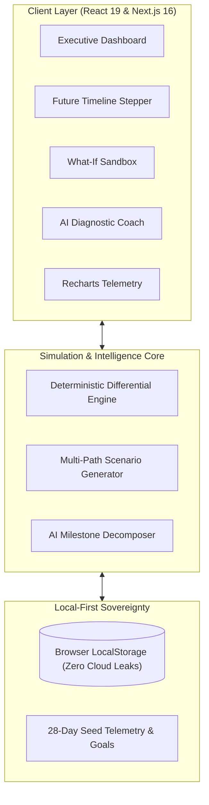

<div align="center">

# 🔮 NEXUS — Personal Future Simulator
### *“See where your habits are taking you.”*

[](https://nextjs.org/)
[](https://react.dev/)
[](https://www.typescriptlang.org/)
[](https://tailwindcss.com/)
[](LICENSE)
[](https://github.com/baadaldev)

<p align="center">
  <b>NEXUS is an AI-powered personal growth and future trajectory simulator.</b><br>
  <i>Not a passive to-do list. Not a basic habit tracker. A true predictive operating system for your ambition.</i>
</p>

[Explore Core Features](#-core-features) •
[Mathematical Engine](#-mathematical-formulation) •
[Architecture](#-system-architecture) •
[Quick Start](#-quick-start) •
[Keyboard Shortcuts](#%EF%B8%8F-keyboard-shortcuts)

---

</div>

## 🌌 The Fundamental Principle

Most habit trackers tell you what you did **yesterday**. NEXUS calculates who you will be **tomorrow**.

$$\mathbf{GOALS} + \mathbf{DAILY\ BEHAVIOR} + \mathbf{CONSISTENCY} + \mathbf{TIME} = \mathbf{PROJECTED\ FUTURE}$$

NEXUS continuously ingests your empirical daily telemetry (study volume, applied project commits, algorithmic practice, streak stability), runs real differential trajectory equations, and renders multi-path simulated futures in real time.

---

## 🌟 Core Features

### 1. ⏱️ "Simulate My Future" Temporal Stepper
Step forward in time through critical empirical milestones:
* **Today (T+0)**: Current baseline and historical velocity index.
* **+30 Days**: Foundation prototype & state management operational.
* **+90 Days**: Applied distributed systems, database scaling & core competencies.
* **+180 Days**: Full production capstone launch & interview/market readiness.
* **Arrival Horizon**: Exact mathematically projected completion date based on rolling 7-day velocity.

### 2. 🎛️ "What-If" Sensitivity Sandbox
Adjust your commitment levers with 60 FPS live feedback:
* **Daily Study Hours** ($0.5\text{h} \rightarrow 6.0\text{h/day}$)
* **Weekly Project Building** ($0\text{h} \rightarrow 25\text{h/week}$)
* **Weekly DSA Problem Solving** ($0 \rightarrow 40\text{ problems/week}$)
* **Consistency Discipline Rate** ($30\% \rightarrow 100\%$)
* **Instant Delta Metrics**: Immediately inspect impacts such as `+45 Days Saved` or `19 Days Delayed`, with a one-click **"Apply to Trajectory"** button.

### 3. 🔀 Multi-Path Alternative Scenario Engine
Simultaneously computes and visualizes three prospective lifelines:
* **Path A (Status Quo)**: Pacing strictly at your current 28-day historical average.
* **Path B (Balanced Trajectory)**: $+35$ min daily, $+2$h weekend project focus (sustainable acceleration).
* **Path C (High Intensity Sprint)**: $+2$h daily aggressive tempo with burnout vulnerability warning models.

### 4. 🧠 AI Goal Decomposer & Roadmap Architect
* Transform high-level ambitions (e.g. *"Become a Senior AI Engineer in 6 months"*) into structured technical milestones.
* Automatically generates estimated hour quotas, skill tags, and daily pacing requirements.

### 5. 🩺 Diagnostic AI Telemetry Life Coach
* Zero generic motivational platitudes.
* Direct analytical diagnosis based on your 28-day telemetry stream:
  > *"Your applied project velocity exceeds the milestone baseline by 18%, but algorithmic practice logged only 2 sessions this week. This introduces a technical interview vulnerability for your Q3 goal."*

### 6. 📊 Mathematical Progress Telemetry (Recharts)
* **Benchmark Curve**: Optimal planned trajectory.
* **Empirical Hours Log**: Exact 28-day historical performance.
* **Projected Future Vector**: Forward trajectory curve.
* **Uncertainty Corridor**: 88% confidence interval band accounting for real-world variance.
* **Effort Breakdown**: Theory & Concept vs. Applied Implementation distribution.

### 7. ⚡ Deep Focus 25-Minute Pomodoro Station
* Integrated deep work focus timer with ambient soundscape integration and auto-logging to historical daily telemetry.

### 8. 👤 "Future You" Digital Twin Persona
* Dynamic technical persona reflecting your verified skills, deployed applications, and identity habits upon completing your projected roadmap.

---

## 🧮 Mathematical Formulation

NEXUS does not guess. It computes trajectories using deterministic differential models:

### 1. Effective Daily Velocity ($V_{\text{eff}}$)
$$V_{\text{eff}} = \left( H_{\text{daily\_study}} + \frac{H_{\text{weekly\_project}}}{7} \right) \times C_{\text{factor}} \times F_{\text{focus}}$$

Where:
* $H_{\text{daily\_study}}$ = Empirical daily study hours logged
* $H_{\text{weekly\_project}}$ = Weekly project development hours
* $C_{\text{factor}}$ = Habit consistency ratio ($0.30 \le C \le 1.0$)
* $F_{\text{focus}}$ = Deep work quality modifier ($0.85 \le F \le 1.15$)

### 2. Projected Completion Horizon ($D_{\text{projected}}$)
$$D_{\text{projected}} = \left\lceil \frac{H_{\text{remaining}}}{V_{\text{eff}}} \right\rceil$$

### 3. Momentum Vector ($M$)
$$M = \left( \frac{V_{\text{rolling\_7d}} - V_{\text{baseline\_28d}}}{V_{\text{baseline\_28d}}} \right) \times 100\%$$

---

## 🏗️ System Architecture



---

## 🛠️ Tech Stack & Libraries

| Domain | Technology | Description |
|---|---|---|
| **Framework** | **Next.js 16.3.6** | App Router, Turbopack, Fast Refresh |
| **Library** | **React 19.2.8** | Client Components, Hooks, Context API |
| **Language** | **TypeScript 5** | End-to-end type safety, strict mode |
| **Styling** | **Tailwind CSS v4** | Dark mode cyber-operating system aesthetic |
| **Charts** | **Recharts 3.10** | Responsive composed charts & uncertainty corridors |
| **Icons** | **Lucide React** | Sleek futuristic iconography |
| **Visual Effects** | **Canvas Confetti & Particles** | 4K interactive background particle neural network |

---

## 🚀 Quick Start

### Prerequisites
* **Node.js**: `v18.18.0` or later (`v20+` recommended)
* **npm**: `v9.0.0` or later

### Installation

```bash
# 1. Clone the repository
git clone https://github.com/baadaldev/-NEXUS-Personal-Future-Simulator.git
cd -NEXUS-Personal-Future-Simulator

# 2. Install dependencies
npm install --legacy-peer-deps

# 3. Run simulation engine verification tests
npx tsx src/lib/simulation/engine.test.ts

# 4. Start the local development server
npm run dev
```

Open [http://localhost:3000](http://localhost:3000) in your browser.

### Production Build

```bash
npm run build
npm run start
```

---

## ⌨️ Keyboard Shortcuts

| Shortcut | Action |
|---|---|
| `Cmd/Ctrl + K` | Universal Command Palette |
| `S` | Navigate to **Simulate My Future** |
| `W` | Navigate to **What-If Sandbox** |
| `G` | Navigate to **Goals & Milestones** |
| `T` or `N` | Open **New Task** / Action Plan |
| `A` | Open **Telemetry Analytics** |
| `C` | Open **AI Diagnostic Coach** |
| `Esc` | Close any active modal dialog |

---

## 🔒 Privacy & Local-First Philosophy

* **100% Client-Side Execution:** All calculations, telemetry logs, and trajectory simulations execute locally in your browser.
* **No Telemetry Telecasting:** No personal routine data, working hours, or private goals are ever transmitted to third-party ad networks or remote servers.

---

## 👨‍💻 Author

**Baadal Dev**
* GitHub: [@baadaldev](https://github.com/baadaldev)
* Repository: [-NEXUS-Personal-Future-Simulator](https://github.com/baadaldev/-NEXUS-Personal-Future-Simulator)

---

## 📄 License

Distributed under the **MIT License**. See [`LICENSE`](LICENSE) for details.
